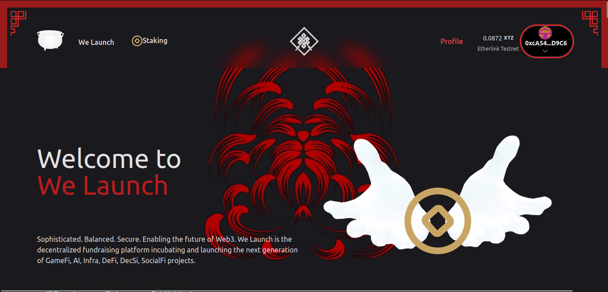
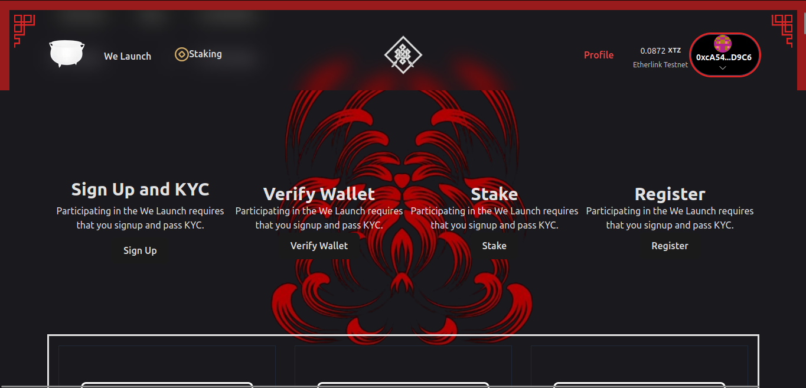
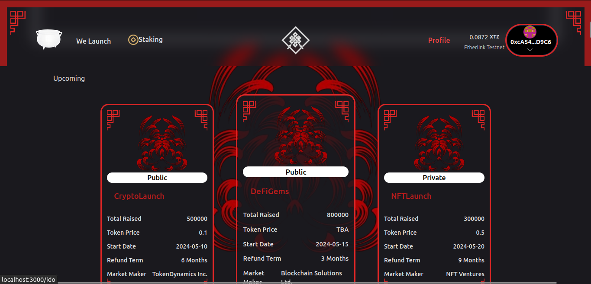
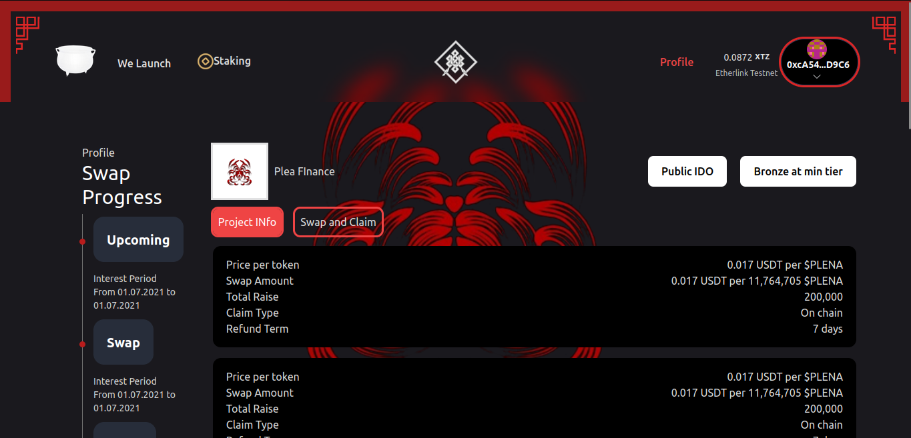
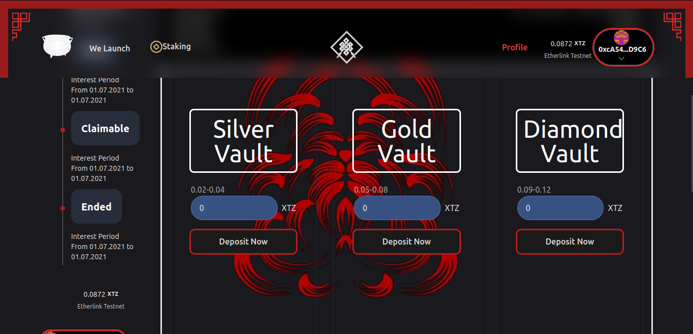
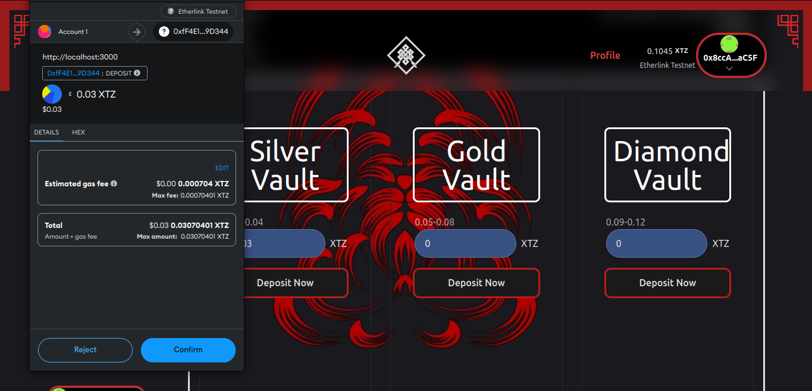
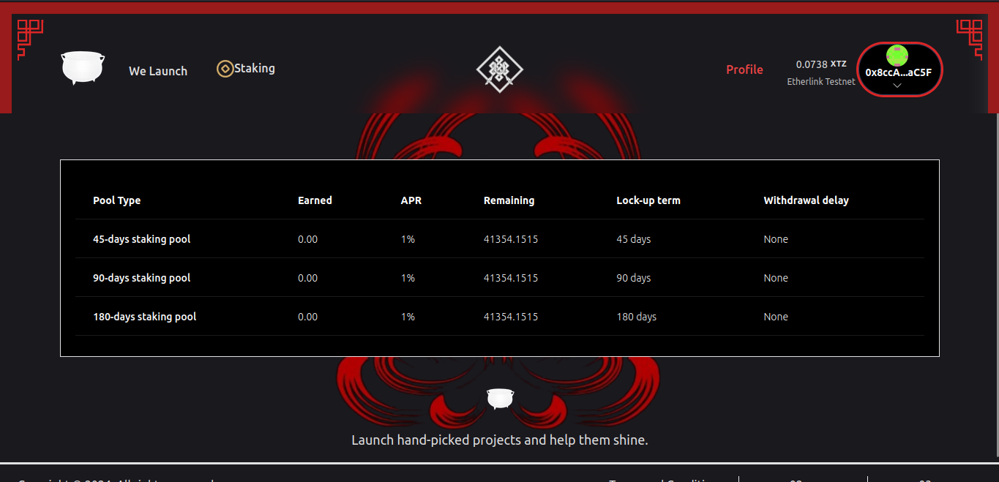
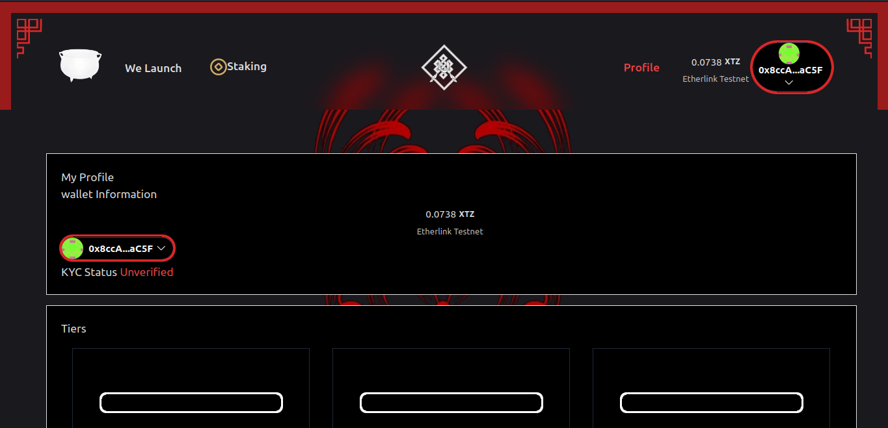

# WE LAUNCH

###### WHAT IS WE LAUNCH?

**WELAUNCH** is platform that empowers users to pool their resources together in vaults, fostering a collaborative investment environment. Here's what you need to know about vault pooling and participation:

**1. Predefined Vaults:** We offer three predefined vaults corresponding to our higher tiers: Silver, Gold, and Diamond. Each vault is strategically curated to provide users with tailored investment opportunities, particularly focused on IDO events.

**2. Tier-Based Access:** Users can choose to deposit their funds into the vault that corresponds to their desired tier level: Silver, Gold, or Diamond. Each tier offers varying levels of benefits and opportunities for participating in exclusive IDO events.

**3. Collective Participation:** Depositing funds into a vault enables users to participate collectively in IDO events. When an IDO event occurs, users within the vault will collectively join the sale, leveraging pooled resources for potentially greater investment power and increased chances of allocation.

###### WHAT COMPONENTS DOES WE LAUNCH POSSES?

**1. Carefully designed and impemented smart contracts**

WeLaunch has a launchpad smart contract that handles everything related to the IDO sale, such as the IDO's max raise plan, IDO's sale start time, IDO's sale end time, number of tiers (in our case, four tiers), max raise per tier, and other related aspects. The launchpad smart contract is developed in a highly secure and optimized manner, ensuring resistance to attacks and minimizing transaction fees required for interaction. There are three main Vault or Pool smart contracts that enable users of our platform to pool their funds together, allowing them to subscribe to higher tiers (silver, gold, and diamond) and ensuring higher allocation amounts. Every functionality of the smart contracts has been thoroughly tested and proven to work flawlessly. Instructions for setting up and running the scripts to deploy the smart contracts and interact with them are clearly provided in this [README](https://github.com/wendecoder/web3scalingHackathon/blob/main/smartContacts/README.md) 

**2. User friendly UI**

WeLaunch has a very user friendly and simple user interface so that any user without much web3 experience can use it effectively. Below are the main components of the UI.

**Landing Page(Hero Section)**

---

**Landing Page(Steps to go through)**

---

**Landing Page(IDOs)**

---

**IDO Page(Info about the IDO)**

---

**IDO Page(Vaults)**

---

**IDO Page(User depositing into the Vault)**

---

**Staking Page**

---

**User Profile Page**

###### WHY DID WE BUILD WELAUNCH?

The motivation behind creating WeLaunch stemmed from dissatisfaction with the current state of launchpad platforms. Many existing platforms require a significant initial investment, often exceeding $5,000, just to subscribe to the second (silver) tier. This high barrier to entry makes it incredibly challenging for individuals with limited funds to participate, effectively creating a system where those with more money can easily accumulate even greater wealth. We believe this approach is fundamentally flawed. Launchpads should be inclusive and accessible to all, regardless of financial means, empowering individuals to leverage these platforms to transform their lives. That's why we developed WeLaunch: a platform dedicated to democratizing access to launchpads, ensuring that even those with modest capital can seize opportunities and embark on their entrepreneurial journey.